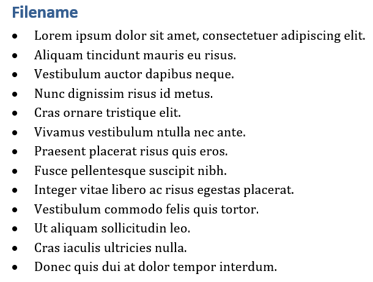

# PDF-Highlight-Extractor

## Description

This repo allows researchers to easily extract the text they highlight in multiple articles and writes them to a docx file as bullet points under the
name of the pdf where they were highlighted as a header.

## Getting Started
Install requirements
 
`pip install -r requirements.txt`

## Usage

Run `main.py` 
 Enter the path to the folder containing the pdfs you have highlighted (make sure that all the pdfs are in the same
folder). 
 Enter the output file name (the name of the docx file to be generated)
 example: `output`
will save the output docx file in the directory of the pdfs as `output.docx`

## References

https://stackoverflow.com/a/63686095